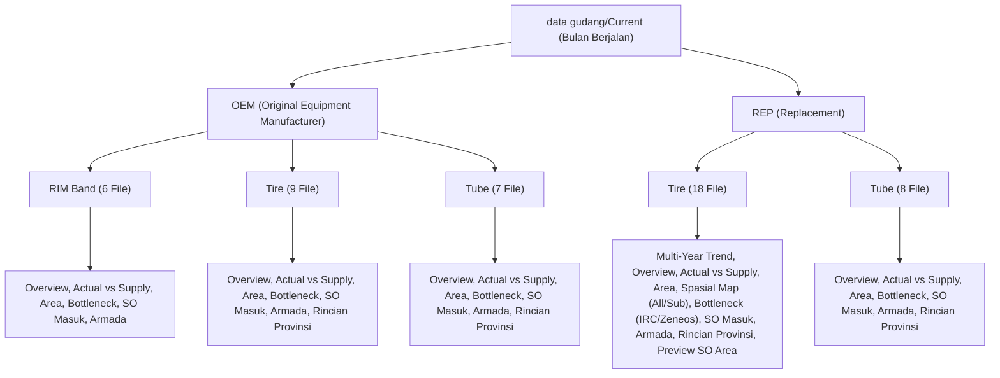

# 📊 Laporan Analisis Komprehensif Data Gudang (Current / Bulan Berjalan)

**PT Gajah Tunggal Tbk — Delivery & Warehouse Operations Dashboard**  
*Tanggal Analisis: 26 Agustus 2026*  
*Sumber Data: Direktori `data gudang/Current/` (Total 48 file CSV)*

---

## 1. 📑 Eksekutif Ringkasan (Executive Summary)

Folder `data gudang/Current/` berisi dataset operasional gudang dan distribusi pengiriman untuk periode **Bulan Berjalan (Agustus 2026)**. Struktur data diorganisasikan secara hierarkis berdasarkan **Tipe Penjualan (Sales Type)**, **Kategori Produk (Product Category)**, dan **Modul Visualisasi/Metrik**.

Secara keseluruhan ditemukan **48 file CSV** yang terbagi ke dalam:
- **OEM (Original Equipment Manufacturer)**: 22 file
  - `RIM Band`: 6 file
  - `Tire`: 9 file
  - `Tube`: 7 file
- **REP (Replacement / Aftermarket)**: 26 file
  - `Tire`: 18 file
  - `Tube`: 8 file

---

## 2. 🗂️ Hierarki dan Struktur Filter Data

Pohon struktur direktori dan relasi filternya adalah sebagai berikut:

### 📌 Implikasi Filter pada Frontend (Cascading Filter Matrix)

| Filter Level 1 (Period) | Filter Level 2 (Sales Type) | Filter Level 3 (Product Type) | Filter Level 4 (Brand / Sub-Kategori) |
| :--- | :--- | :--- | :--- |
| **Current** (Bulan Berjalan) | **OEM** | **RIM Band** | Default / All |
| **Current** (Bulan Berjalan) | **OEM** | **Tire** | IRC |
| **Current** (Bulan Berjalan) | **OEM** | **Tube** | IRC |
| **Current** (Bulan Berjalan) | **REP** | **Tire** | All / IRC Tubeless / IRC Tube Type / Zeneos Tubeless / Zeneos |
| **Current** (Bulan Berjalan) | **REP** | **Tube** | IRC |

> [!NOTE]
> Pada implementasi awal di frontend (`useDashboardData.js`), filter OEM sebelumnya hanya dibatasi untuk `RIM Band`. Dari analisis data aktual, OEM ternyata memiliki data lengkap untuk **Tire**, **Tube**, dan **RIM Band**. Cascading dropdown di frontend perlu diperbarui agar mendukung ketiga kategori ini di OEM.

---

## 3. 🎯 Pemetaan Data ke Komponen Frontend (Chart Mapping)

Berikut adalah pemetaan setiap file CSV ke komponen dashboard frontend (TopBar dan Chart A s/d Chart J):

### 1. Top Bar Metrics & Operational Calendar
- **Sumber Data**: Berasal dari total agregasi status SO dan target aktual bulanan.
- **Kondisi Bulan Berjalan (Agustus 2026)**:
  - Hari kerja berjalan: **12 hari** dari total **19 hari kerja**.
  - Target MTD Formula: $\frac{12}{19} \times 100\% = 63.16\%$
  - Target EOW Formula: $\min\left(100\%, \frac{12 + 5}{19} \times 100\%\right) = 89.47\%$
  - Target & Achievement Aktual: Total Target = `1,765,800 Pcs`, Actual Sales MTD = `1,115,297 Pcs` (Closed Sales REP Tire).

---

### 2. Chart A: Multi-Year Sales Trend (3 Tahun Terakhir)
- **Komponen**: [ChartA_MultiYearSalesTrend.jsx](file:///d:/Binus/Gajah%20Tunggal/Delivery%20Dashboard%20Gudang/frontend/src/pages/Dashboard/components/charts/ChartA_MultiYearSalesTrend.jsx)
- **File Sumber**: `Current/REP/Tire/Data Multi-Year Sales Trend (3 Tahun Terakhir).csv`
- **Tipe Data**: Tren histori penjualan bulanan tahun 2024, 2025, dan 2026 (Jan–Agu).
- **Struktur Kolom**: `Bulan`, `2024`, `2025`, `2026`, `Grand Total`.
- **Catatan**: Khusus untuk kategori REP Tire.

---

### 3. Chart B: Status Sales Order (Overview)
- **Komponen**: [ChartB_SalesOrderStatus.jsx](file:///d:/Binus/Gajah%20Tunggal/Delivery%20Dashboard%20Gudang/frontend/src/pages/Dashboard/components/charts/ChartB_SalesOrderStatus.jsx)
- **File Sumber**:
  - `Current/OEM/RIM Band/Status Sales Order (Overview).csv` (Closed: 17,994 | Awaiting Shipping: 12,485 | Booked: 1,160)
  - `Current/OEM/Tire/Status Sales Order (Overview).csv` (Closed: 455,907 | Awaiting Shipping: 399,651 | Booked: 976)
  - `Current/OEM/Tube/Status Sales Order.csv` (Closed: 48,839 | Awaiting Shipping: 42,626 | Booked: 482)
  - `Current/REP/Tire/Status Sales Order (Overview).csv` (Closed: 1,115,297 | Awaiting Shipping: 553,292 | Booked: 1,383,124 | Entered: 905,395)
  - `Current/REP/Tube/Status Sales Order (Overview).csv` (Closed: 1,077,930 | Awaiting Shipping: 771,330 | Booked: 1,417,110 | Entered: 692,040)
- **Tipe Visualisasi**: Donut Chart & Breakdown Card (Booked, Entered, Awaiting Shipping, Closed).

---

### 4. Chart C: Actual Sales vs Supply Plan
- **Komponen**: [ChartC_ActualVsSupplyPlan.jsx](file:///d:/Binus/Gajah%20Tunggal/Delivery%20Dashboard%20Gudang/frontend/src/pages/Dashboard/components/charts/ChartC_ActualVsSupplyPlan.jsx)
- **File Sumber**:
  - `Current/OEM/RIM Band/Actual Sales vs Supply Plan.csv` (RIM Band: 17,994 pcs)
  - `Current/OEM/Tire/Actual Sales vs Supply Plan.csv` (Tire Import: 1,465 / 2,760 [53.08%], Tube Type: 48,729 / 88,951 [54.78%], Tubeless: 405,413 / 669,429 [60.56%])
  - `Current/OEM/Tube/Actual Sales vs Supply Plan.csv` (IRC Tube: 48,539 / 89,882 [54.00%])
  - `Current/REP/Tire/Actual Sales vs Supply Plan.csv` (IRC Tube Type: 588,220 / 967,905 [60.77%], IRC Tubeless: 442,390 / 705,000 [62.75%], Zeneos Tubeless: 84,467 / 150,625 [56.08%])
  - `Current/REP/Tube/Actual Sales vs Supply Plan.csv` (IRC Tube: 1,077,930 / 1,784,000 [60.42%])
- **Tipe Visualisasi**: Grouped Bar / Progress Fulfillment Chart.

---

### 5. Chart D: Pencapaian Target per Area
- **Komponen**: [ChartD_TargetPerArea.jsx](file:///d:/Binus/Gajah%20Tunggal/Delivery%20Dashboard%20Gudang/frontend/src/pages/Dashboard/components/charts/ChartD_TargetPerArea.jsx)
- **File Sumber**:
  - `Current/OEM/RIM Band/Pencapaian Target per Area.csv` (Jakarta: 13,512 | Jawa Barat: 4,482)
  - `Current/OEM/Tire/Pencapaian Target per Area.csv` (Jakarta: 51,369 | Jawa Barat: 404,538)
  - `Current/OEM/Tube/Pencapaian Target per Area.csv` (Jakarta: 13,470 | Jawa Barat: 35,369)
  - `Current/REP/Tire/Pencapaian Target per Area.csv` (11 Area Nasional: Kalimantan 71.3%, Sumatera 68.4%, Jawa Barat 68.4%, Jawa Tengah 68.2%, Bali & NT 65.9%, Jawa Timur 61.9%, Jakarta 56.6%, Sulawesi 50.0%, Banten 49.0%, Papua 47.6%, Maluku 47.0%)
  - `Current/REP/Tube/Pencapaian Target per Area.csv` (9 Area: Sulawesi 41.72%, Jawa Timur 42.36%, Banten 50.10%, Jawa Tengah 50.82%, Jawa Barat 52.96%, Bali & NT 57.00%, Kalimantan 58.48%, Sumatera 88.23%)
- **Tipe Visualisasi**: Horizontal Ranking Bar Chart per Area.

---

### 6. Chart E: Peta Distribusi Spasial Pencapaian Target
- **Komponen**: [ChartE_SpatialMap.jsx](file:///d:/Binus/Gajah%20Tunggal/Delivery%20Dashboard%20Gudang/frontend/src/pages/Dashboard/components/charts/ChartE_SpatialMap.jsx)
- **File Sumber**:
  - **REP Tire**:
    - **Agregat Nasional**: `Current/REP/Tire/Peta Distribusi Pencapaian Target Spasial.csv` (34 Provinsi)
    - **Sub-Kategori IRC Tube Type**: `Current/REP/Tire/Peta Distribusui Pencapaian Target Spasial/IRC Tube Type.csv` (31 Provinsi)
    - **Sub-Kategori IRC Tubeless**: `Current/REP/Tire/Peta Distribusui Pencapaian Target Spasial/IRC Tubeless.csv` (32 Provinsi)
    - **Sub-Kategori Zeneos Tubeless**: `Current/REP/Tire/Peta Distribusui Pencapaian Target Spasial/Zeneos Tubeless.csv` (25 Provinsi)
  - **REP Tube**:
    - **Agregat Nasional**: `Current/REP/Tube/Peta Distribusi Pencapaian Target Spasial.csv` (34 Provinsi)
    - **Sub-Kategori IRC Tube**: `Current/REP/Tube/Peta Distribusi Pencapaian Target Spasial/IRC Tube.csv` (34 Provinsi)
- **Tipe Visualisasi**: Choropleth Map Indonesia (Warna gradasi berdasarkan % Pencapaian) + Tooltip Detail.

---

### 7. Chart F: Top 5 SKU Supply Bottleneck (Pencapaian Terendah)
- **Komponen**: [ChartF_BottleneckSKU.jsx](file:///d:/Binus/Gajah%20Tunggal/Delivery%20Dashboard%20Gudang/frontend/src/pages/Dashboard/components/charts/ChartF_BottleneckSKU.jsx)
- **File Sumber**:
  - `Current/OEM/RIM Band/Top 5 SKU Supply Bottleneck-RIM Band.csv` (PXI2517-0, PXJ2702-0, PXJ3202-0, PXK1719-0, PXM2701-0)
  - `Current/OEM/Tire/Top 5 SKU Supply Bottleneck-IRC.csv` (IAF8019SP-0 [25.0%], IAF1007SP-0 [33.33%], IAI1011-0 [19.23%], IAI1205-0 [21.43%], IAM2703SP-0 [27.7%])
  - `Current/OEM/Tube/Top 5 SKU Supply Bottleneck-IRC.csv` (THT2702-0 [41.33%], ITI1001-0 [24.07%], THT3001-0 [37.14%], ITI3001-0 [35.35%], ITI2701-0 [40.34%])
  - `Current/REP/Tire/Top 5 SKU Supply Bottlenec/IRC.csv` (IAF1012-1 [1.67%], IBC3505-1 [3.11%], IAI8013-1 [2.89%], IAI7029-1 [5.0%], IAI8025-1 [4.82%])
  - `Current/REP/Tire/Top 5 SKU Supply Bottlenec/Zeneos.csv` (PAH7001-1 [28.57%], PAI7009-1 [27.27%], PAF1201-1 [14.76%], PAI8014-1 [25.71%], PAF8008-1 [21.67%])
  - `Current/REP/Tube/Top 5 SKU Supply Bottleneck-IRC.csv` (ITI1003-1 [8.89%], ITK2502-1 [15.69%], ITH8002-1 [34.29%], ITA3502-1 [27.97%], ITJ2202-1 [32.92%])
- **Tipe Visualisasi**: Alert List / Horizontal Progress Bar untuk SKU kritis dengan rasio pasokan terendah.

---

### 8. Chart G: Status Sales Order Masuk Gudang
- **Komponen**: [ChartG_WarehouseSOStatus.jsx](file:///d:/Binus/Gajah%20Tunggal/Delivery%20Dashboard%20Gudang/frontend/src/pages/Dashboard/components/charts/ChartG_WarehouseSOStatus.jsx)
- **File Sumber**:
  - `Current/OEM/RIM Band/Status SO Masuk Gudang.csv` (Closed: 17,994 | Awaiting Shipping: 10,515 | Awaiting Delivery: 1,970)
  - `Current/OEM/Tire/Status SO Masuk Gudang.csv` (Closed: 455,907 | Awaiting Shipping: 319,856 | Awaiting Delivery: 79,795)
  - `Current/OEM/Tube/Status SO Masuk Gudang.csv` (Closed: 48,839 | Awaiting Shipping: 34,301 | Awaiting Delivery: 8,325)
  - `Current/REP/Tire/Status SO Masuk Gudang.csv` (Closed: 1,115,297 | Awaiting Shipping: 365,937 | Awaiting Delivery: 187,355)
  - `Current/REP/Tube/Status SO Masuk Gudang.csv` (Closed: 1,077,930 | Awaiting Shipping: 550,800 | Awaiting Delivery: 220,530)
- **Tipe Visualisasi**: Horizontal Stacked Bar / Status Breakdown (Awaiting Delivery, Awaiting Shipping, Closed).

---

### 9. Chart H: Rencana Kirim Armada Hari Ini
- **Komponen**: [ChartH_DailyTruckPlan.jsx](file:///d:/Binus/Gajah%20Tunggal/Delivery%20Dashboard%20Gudang/frontend/src/pages/Dashboard/components/charts/ChartH_DailyTruckPlan.jsx)
- **File Sumber**:
  - `Current/OEM/RIM Band/Rencana Kirim Armada Hari Ini.csv` (Gulungan: 135 pcs | Loading Hari Ini: 2,890 pcs | Loading Selanjutnya: 5,300 pcs)
  - `Current/OEM/Tire/Rencana Kirim Armada Hari Ini.csv` (Gulungan: 1,640 pcs [1.8 engkel] | Loading Hari Ini: 29,952 pcs [33.4 engkel] | Loading Selanjutnya: 48,203 pcs [53.9 engkel])
  - `Current/OEM/Tube/Rencana Kirim Armada Hari Ini.csv` (Gulungan: 135 pcs | Loading Hari Ini: 2,890 pcs | Loading Selanjutnya: 5,300 pcs)
  - `Current/REP/Tire/Rencana Kirim Armada Hari Ini.csv` (Loading Hari Ini: 102,770 ban / 71 engkel | Gulungan: 78,585 ban / 45 engkel | Loading Selanjutnya: 6,000 ban / 2 engkel)
  - `Current/REP/Tube/Rencana Kirim Armada Hari Ini.csv` (Gulungan: 190,140 pcs / 8 engkel | Loading Hari Ini: 30,390 pcs / 1 engkel)
- **Tipe Visualisasi**: Fleet Capacity Summary Cards (Total Engkel & Total Unit Pcs).

---

### 10. Chart I: Rincian Distribusi Kirim per Provinsi (Armada Engkel)
- **Komponen**: [ChartI_ProvinceTruckDistribution.jsx](file:///d:/Binus/Gajah%20Tunggal/Delivery%20Dashboard%20Gudang/frontend/src/pages/Dashboard/components/charts/ChartI_ProvinceTruckDistribution.jsx)
- **File Sumber**:
  - `Current/OEM/Tire/Rincian Distribusi Kirim per Provinsi/` (`gulungan.csv`, `loading hari ini.csv`, `loading selanjutnya.csv`)
  - `Current/OEM/Tube/Rincian Distribusi Kirim per Provinsi.csv`
  - `Current/REP/Tire/Rincian Distribusi Kirim per Provinsi/` (`Gulungan.csv`, `Loading hari ini.csv`, `Loading selanjutnya.csv`)
  - `Current/REP/Tube/Rincian Distribusi Kirim per Provinsi/` (`Gulungan.csv`, `Loading Hari ini.csv`)
- **Tipe Visualisasi**: Bar Chart Distribusi Armada per Provinsi dengan toggle filter (`Semua`, `Loading Hari Ini`, `Gulungan`, `Loading Selanjutnya`).

---

### 11. Chart J: Preview SO per Area (Khusus Channel REP)
- **Komponen**: [ChartJ_RepSOPreview.jsx](file:///d:/Binus/Gajah%20Tunggal/Delivery%20Dashboard%20Gudang/frontend/src/pages/Dashboard/components/charts/ChartJ_RepSOPreview.jsx)
- **File Sumber**:
  - `Current/REP/Tire/Preview SO Per Area/IRC Tubeless.csv` (11 Area: Jakarta, Jateng, Jatim, Kalimantan, Papua, Sulawesi, Sumatera, Bali & NT, Banten, Jabar, Maluku)
  - `Current/REP/Tire/Preview SO Per Area/IRC Tubetype.csv` (11 Area)
  - `Current/REP/Tire/Preview SO Per Area/Zeneos Tubeless.csv` (11 Area)
- **Struktur Kolom**: `Provinsi/Area`, `Target EOW (89.47%)`, `Target MTD (63.16%)`, `Closed/terkirim (%)`, `Loading Hari Ini (%)`, `Gulungan (%)`.
- **Tipe Visualisasi**: Comprehensive Multi-Metric Comparison Table / Progress Bars dengan threshold MTD dan EOW.

---

## 4. 🔍 Temuan Teknis, Format File, dan Rekomendasi Normalisasi

Hasil audit mendalam terhadap 48 file CSV menemukan beberapa detail format yang perlu ditangani saat implementasi data parser di frontend:

| Aspek | Temuan Aktual pada File CSV | Rekomendasi Solusi Frontend |
| :--- | :--- | :--- |
| **Encoding File** | File `OEM/RIM Band/Actual Sales vs Supply Plan.csv` & `OEM/Tire/Actual Sales vs Supply Plan.csv` berformat **UTF-16LE with BOM** (memiliki null-byte `\x00`), sedangkan file lain UTF-8. | Parser/API layer perlu mendukung decoding UTF-16LE & UTF-8 atau melakukan standardisasi data ke JSON/JS Object. |
| **Delimiter** | Mayoritas file menggunakan delimiter titik-koma (`;`), beberapa file memiliki kolom kosong di ujung kanan. | Gunakan regex split `/(?:;|\t|,)/` dengan pembersihan trim & filter sel kosong. |
| **Header Format** | Beberapa file tidak memiliki baris header (langsung baris nilai, misal `Status Sales Order (Overview).csv` dan `Rencana Kirim Armada Hari Ini.csv`), sedangkan beberapa memiliki 2 baris pivot header. | Lakukan pemetaan skema berbasis nama file/kategori secara deterministik. |
| **Formula Error Excel** | File `OEM/RIM Band/Pencapaian Target per Area.csv` dan `OEM/Tire/Pencapaian Target per Area.csv` berisi nilai `#NUM!` pada kolom persentase. | Fallback kalkulasi persentase langsung di frontend jika nilai `#NUM!` terdeteksi. |
| **Format Nilai Persentase** | Terdapat 3 format berbeda: desimal murni (`0.6077`), string persentase (`60.42%`), dan desimal rasio (`0.016666`). | Fungsi helper `parsePercentage()` terpadu yang dapat mengenali ketiga format. |
| **Format Satuan Armada** | Nilai armada ditulis dengan satuan, misal `"16.7 engkel"` atau `"78585 ban"`. | Helper fungsi `parseNumericValue()` untuk mengekstrak angka murni (float/int). |
| **Typo Nama Folder / File** | Folder `Top 5 SKU Supply Bottlenec` (kurang huruf 'k'), `Peta Distribusui...` (kelebihan huruf 'u'), dan variasi kapitalisasi (`Loading hari ini.csv` vs `Loading Hari ini.csv`). | Normalisasi path case-insensitive dan penanganan alias path di API loader. |

---

## 5. 🚀 Rencana Arsitektur & Langkah Implementasi Selanjutnya

1. **Struktur Data JSON Terpadu (Unified Data Store)**:
   - Membuat modul data store terstruktur yang memetakan seluruh 48 file ke dalam skema:
     `datasets[salesType][productType][metricName]`.
2. **Koneksi State & Filter Frontend**:
   - Memperbarui `useDashboardData.js` agar dropdown **Sales Type** (`OEM` dan `REP`) dan **Product Type** (`Tire`, `Tube`, `RIM Band`) secara otomatis mengalirkan dataset yang sesuai ke semua chart (Chart B sampai Chart I).
   - Memastikan saat `salesType === 'OEM'`, pilihan produk adalah `['Tire', 'Tube', 'RIM Band']`, dan saat `salesType === 'REP'`, pilihannya adalah `['Tire', 'Tube']`.
   - Mengintegrasikan sub-filter pada Chart E (Peta Spasial), Chart F (Bottleneck), Chart I (Armada Provinsi), dan Chart J (Preview SO) sesuai dengan sub-folder CSV yang tersedia.
3. **Verifikasi Tampilan & Interaktivitas UI**:
   - Memastikan visualisasi Chart A–J terisi dengan angka riil dari data gudang, termasuk tooltip, target MTD/EOW line, dan styling responsif.
