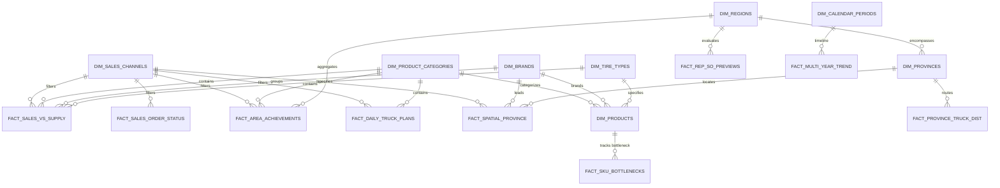

# 🗄️ Rancangan Skema Database Backend & Arsitektur Data Warehouse
**PT Gajah Tunggal Tbk — Delivery & Warehouse Operations Dashboard**

---

## 1. 📌 Analisis Domain Bisnis & Sumber Data

Berdasarkan audit komprehensif terhadap **48 file CSV** pada direktori `data gudang/Current/` (Bulan Berjalan: Agustus 2026), seluruh metrik operasional dashboard terbagi dalam hierarki bisnis berikut:

1. **Saluran Penjualan (*Sales Channel*)**:
   - **OEM** (*Original Equipment Manufacturer*): Pasokan langsung ke pabrikan perakit kendaraan.
   - **REP** (*Replacement / Aftermarket*): Pasokan ke jaringan distributor & toko retail nasional.
   - **EXP** (*International Export*): Pengiriman ekspor global.
2. **Kategori Produk (*Product Category*)**:
   - **Tire** (Ban Luar Sepeda Motor / Radial).
   - **Tube** (Ban Dalam).
   - **RIM Band** (Selendang Velg).
3. **Merek & Varian Produk (*Brand & Construction Type*)**:
   - Merek: **IRC**, **ZENEOS**, **RIM BAND**.
   - Jenis Konstruksi: **Tubeless**, **Tube Type**, **Tire Import**, **Radial Export**.
4. **Hierarki Geografis (*Geographical Hierarchy*)**:
   - **11 Wilayah Regional Operasional**: Sumatera, Jawa Barat, Jawa Tengah, Jawa Timur, Jakarta, Banten, Bali & Nusa Tenggara, Kalimantan, Sulawesi, Maluku, Papua.
   - **34 Provinsi Indonesia (WGS84 Spasial)**: Digunakan untuk visualisasi Choropleth GeoChart.
5. **Siklus Status Sales Order (SO Lifecycle)**:
   - **Booked** → **Entered** → **Awaiting Delivery** → **Awaiting Shipping** → **Closed**.
6. **Logistik Armada (*Fleet Logistics*)**:
   - Distribusi truk Engkel (Kategori: *Loading Hari Ini*, *Gulungan*, *Loading Selanjutnya*).

---

## 2. 🏛️ Model ERD (Entity Relationship Diagram)

Arsitektur database mengadopsi model **Star Schema / Snowflake Hybrid** yang dinormalisasi pada level dimensi dan teroptimasi untuk analitik agregasi cepat (*fast OLAP querying*):



---

## 3. 📋 Spesifikasi Skema Database Relasional (DDL SQL)

### 🔹 A. Tabel Dimensi Master (Master Dimensions)

```sql
-- 1. Dimensi Saluran Penjualan (Sales Channel)
CREATE TABLE dim_sales_channels (
    channel_id VARCHAR(10) PRIMARY KEY, -- OEM, REP, EXP
    channel_name VARCHAR(100) NOT NULL,
    description TEXT,
    is_active BOOLEAN DEFAULT TRUE,
    created_at TIMESTAMP WITH TIME ZONE DEFAULT CURRENT_TIMESTAMP
);

-- 2. Dimensi Kategori Produk (Product Category)
CREATE TABLE dim_product_categories (
    category_id VARCHAR(20) PRIMARY KEY, -- TIRE, TUBE, RIM_BAND
    category_name VARCHAR(100) NOT NULL,
    unit_measurement VARCHAR(20) DEFAULT 'Pcs',
    is_active BOOLEAN DEFAULT TRUE,
    created_at TIMESTAMP WITH TIME ZONE DEFAULT CURRENT_TIMESTAMP
);

-- 3. Dimensi Brand (Merek)
CREATE TABLE dim_brands (
    brand_id VARCHAR(20) PRIMARY KEY, -- IRC, ZENEOS, RIM_BAND, EXPORT
    brand_name VARCHAR(100) NOT NULL,
    logo_url VARCHAR(255),
    is_active BOOLEAN DEFAULT TRUE,
    created_at TIMESTAMP WITH TIME ZONE DEFAULT CURRENT_TIMESTAMP
);

-- 4. Dimensi Tipe Konstruksi / Jenis Ban (Tire Type)
CREATE TABLE dim_tire_types (
    type_id VARCHAR(30) PRIMARY KEY, -- TUBELESS, TUBETYPE, TIRE_IMPORT, RADIAL_EXPORT, TUBE, RIM_BAND
    type_name VARCHAR(100) NOT NULL,
    category_id VARCHAR(20) REFERENCES dim_product_categories(category_id),
    created_at TIMESTAMP WITH TIME ZONE DEFAULT CURRENT_TIMESTAMP
);

-- 5. Dimensi Master Produk & SKU
CREATE TABLE dim_products (
    sku_code VARCHAR(50) PRIMARY KEY, -- e.g. IAF8019SP-0, PXI2517-0
    pattern_name VARCHAR(150) NOT NULL,
    brand_id VARCHAR(20) REFERENCES dim_brands(brand_id),
    category_id VARCHAR(20) REFERENCES dim_product_categories(category_id),
    type_id VARCHAR(30) REFERENCES dim_tire_types(type_id),
    created_at TIMESTAMP WITH TIME ZONE DEFAULT CURRENT_TIMESTAMP
);

-- 6. Dimensi 11 Wilayah Regional Operasional Gudang
CREATE TABLE dim_regions (
    region_id VARCHAR(30) PRIMARY KEY, -- SUMATERA, JAWA_BARAT, KALIMANTAN, etc.
    region_name VARCHAR(100) NOT NULL,
    display_order INT DEFAULT 0,
    created_at TIMESTAMP WITH TIME ZONE DEFAULT CURRENT_TIMESTAMP
);

-- 7. Dimensi 34/38 Provinsi Indonesia (Spasial)
CREATE TABLE dim_provinces (
    province_id VARCHAR(10) PRIMARY KEY,   -- ID-JB, ID-KT, etc.
    province_name_id VARCHAR(100) NOT NULL, -- Jawa Barat
    province_name_en VARCHAR(100) NOT NULL, -- West Java
    geojson_name VARCHAR(100) NOT NULL,     -- JAWA BARAT
    region_id VARCHAR(30) REFERENCES dim_regions(region_id),
    latitude NUMERIC(10, 6),
    longitude NUMERIC(10, 6),
    created_at TIMESTAMP WITH TIME ZONE DEFAULT CURRENT_TIMESTAMP
);

-- 8. Dimensi Kalender Operasional & Target Periode
CREATE TABLE dim_calendar_periods (
    period_id VARCHAR(20) PRIMARY KEY, -- 2026-08
    year INT NOT NULL,
    month INT NOT NULL,
    month_name VARCHAR(30) NOT NULL,
    total_working_days INT NOT NULL DEFAULT 19,
    current_working_day INT NOT NULL DEFAULT 12,
    target_mtd_pct NUMERIC(5, 2) GENERATED ALWAYS AS ((current_working_day::numeric / total_working_days::numeric) * 100) STORED,
    target_eow_pct NUMERIC(5, 2) GENERATED ALWAYS AS (LEAST(100.0, ((current_working_day + 5)::numeric / total_working_days::numeric) * 100)) STORED,
    created_at TIMESTAMP WITH TIME ZONE DEFAULT CURRENT_TIMESTAMP
);
```

### 🔹 B. Tabel Fakta & Analitik Operasional (Fact Tables)

```sql
-- 1. Fakta Multi-Year Sales Trend (Chart A)
CREATE TABLE fact_multi_year_sales_trend (
    id BIGSERIAL PRIMARY KEY,
    period_year INT NOT NULL,
    period_month INT NOT NULL,
    month_label VARCHAR(10) NOT NULL, -- Jan, Feb, etc.
    channel_id VARCHAR(10) REFERENCES dim_sales_channels(channel_id),
    category_id VARCHAR(20) REFERENCES dim_product_categories(category_id),
    sales_qty NUMERIC(15, 2) NOT NULL,
    created_at TIMESTAMP WITH TIME ZONE DEFAULT CURRENT_TIMESTAMP,
    CONSTRAINT uq_multi_year UNIQUE (period_year, period_month, channel_id, category_id)
);

-- 2. Fakta Status Sales Order (Chart B & Chart G)
CREATE TABLE fact_sales_order_status (
    id BIGSERIAL PRIMARY KEY,
    period_id VARCHAR(20) REFERENCES dim_calendar_periods(period_id),
    channel_id VARCHAR(10) REFERENCES dim_sales_channels(channel_id),
    category_id VARCHAR(20) REFERENCES dim_product_categories(category_id),
    status_category VARCHAR(30) NOT NULL, -- OVERVIEW_SO vs WAREHOUSE_SO
    status_label VARCHAR(50) NOT NULL,    -- BOOKED, ENTERED, AWAITING_SHIPPING, AWAITING_DELIVERY, CLOSED
    order_count NUMERIC(15, 2) NOT NULL DEFAULT 0,
    percentage NUMERIC(6, 2) DEFAULT 0,
    created_at TIMESTAMP WITH TIME ZONE DEFAULT CURRENT_TIMESTAMP
);

-- 3. Fakta Actual Sales vs Supply Plan (Chart C)
CREATE TABLE fact_sales_vs_supply_plan (
    id BIGSERIAL PRIMARY KEY,
    period_id VARCHAR(20) REFERENCES dim_calendar_periods(period_id),
    channel_id VARCHAR(10) REFERENCES dim_sales_channels(channel_id),
    category_id VARCHAR(20) REFERENCES dim_product_categories(category_id),
    brand_id VARCHAR(20) REFERENCES dim_brands(brand_id),
    type_id VARCHAR(30) REFERENCES dim_tire_types(type_id),
    display_category VARCHAR(100) NOT NULL, -- IRC TUBETYPE, IRC TUBELESS, ZENEOS TUBELESS
    actual_sales_qty NUMERIC(15, 2) NOT NULL DEFAULT 0,
    supply_plan_qty NUMERIC(15, 2) NOT NULL DEFAULT 0,
    achievement_pct NUMERIC(6, 2) GENERATED ALWAYS AS (
        CASE WHEN supply_plan_qty > 0 THEN (actual_sales_qty / supply_plan_qty) * 100 ELSE 0 END
    ) STORED,
    created_at TIMESTAMP WITH TIME ZONE DEFAULT CURRENT_TIMESTAMP
);

-- 4. Fakta Pencapaian Target per Regional Area (Chart D)
CREATE TABLE fact_area_achievements (
    id BIGSERIAL PRIMARY KEY,
    period_id VARCHAR(20) REFERENCES dim_calendar_periods(period_id),
    channel_id VARCHAR(10) REFERENCES dim_sales_channels(channel_id),
    category_id VARCHAR(20) REFERENCES dim_product_categories(category_id),
    region_id VARCHAR(30) REFERENCES dim_regions(region_id),
    actual_qty NUMERIC(15, 2) NOT NULL DEFAULT 0,
    target_qty NUMERIC(15, 2) NOT NULL DEFAULT 0,
    achievement_pct NUMERIC(6, 2) NOT NULL DEFAULT 0,
    created_at TIMESTAMP WITH TIME ZONE DEFAULT CURRENT_TIMESTAMP
);

-- 5. Fakta Peta Distribusi Spasial 34 Provinsi (Chart E)
CREATE TABLE fact_spatial_province_achievements (
    id BIGSERIAL PRIMARY KEY,
    period_id VARCHAR(20) REFERENCES dim_calendar_periods(period_id),
    channel_id VARCHAR(10) REFERENCES dim_sales_channels(channel_id),
    category_id VARCHAR(20) REFERENCES dim_product_categories(category_id),
    sub_category VARCHAR(50) NOT NULL DEFAULT 'ALL', -- ALL, IRC TUBELESS, IRC TUBETYPE, ZENEOS TUBELESS
    province_id VARCHAR(10) REFERENCES dim_provinces(province_id),
    achievement_pct NUMERIC(6, 2) NOT NULL DEFAULT 0, -- % Closed Order Area
    leader_brand_id VARCHAR(20) REFERENCES dim_brands(brand_id),
    created_at TIMESTAMP WITH TIME ZONE DEFAULT CURRENT_TIMESTAMP
);

-- 6. Fakta Top 5 SKU Supply Bottlenecks (Chart F)
CREATE TABLE fact_sku_supply_bottlenecks (
    id BIGSERIAL PRIMARY KEY,
    period_id VARCHAR(20) REFERENCES dim_calendar_periods(period_id),
    channel_id VARCHAR(10) REFERENCES dim_sales_channels(channel_id),
    category_id VARCHAR(20) REFERENCES dim_product_categories(category_id),
    brand_id VARCHAR(20) REFERENCES dim_brands(brand_id),
    sku_code VARCHAR(50) REFERENCES dim_products(sku_code),
    demand_qty NUMERIC(15, 2) DEFAULT 0,
    supply_qty NUMERIC(15, 2) DEFAULT 0,
    fulfillment_pct NUMERIC(6, 2) NOT NULL DEFAULT 0,
    created_at TIMESTAMP WITH TIME ZONE DEFAULT CURRENT_TIMESTAMP
);

-- 7. Fakta Rencana Kirim Armada Hari Ini (Chart H)
CREATE TABLE fact_daily_truck_plans (
    id BIGSERIAL PRIMARY KEY,
    plan_date DATE NOT NULL,
    channel_id VARCHAR(10) REFERENCES dim_sales_channels(channel_id),
    category_id VARCHAR(20) REFERENCES dim_product_categories(category_id),
    dispatch_type VARCHAR(50) NOT NULL, -- LOADING_HARI_INI, GULUNGAN, LOADING_SELANJUTNYA
    truck_count_engkel NUMERIC(8, 2) NOT NULL DEFAULT 0,
    tire_qty NUMERIC(15, 2) NOT NULL DEFAULT 0,
    created_at TIMESTAMP WITH TIME ZONE DEFAULT CURRENT_TIMESTAMP
);

-- 8. Fakta Rincian Distribusi Armada per Provinsi (Chart I)
CREATE TABLE fact_province_truck_distributions (
    id BIGSERIAL PRIMARY KEY,
    period_id VARCHAR(20) REFERENCES dim_calendar_periods(period_id),
    channel_id VARCHAR(10) REFERENCES dim_sales_channels(channel_id),
    category_id VARCHAR(20) REFERENCES dim_product_categories(category_id),
    province_id VARCHAR(10) REFERENCES dim_provinces(province_id),
    loading_hari_ini_engkel NUMERIC(8, 2) DEFAULT 0,
    gulungan_engkel NUMERIC(8, 2) DEFAULT 0,
    loading_selanjutnya_engkel NUMERIC(8, 2) DEFAULT 0,
    total_engkel NUMERIC(8, 2) GENERATED ALWAYS AS (loading_hari_ini_engkel + gulungan_engkel + loading_selanjutnya_engkel) STORED,
    created_at TIMESTAMP WITH TIME ZONE DEFAULT CURRENT_TIMESTAMP
);

-- 9. Fakta Preview SO per Area Channel REP (Chart J)
CREATE TABLE fact_rep_so_previews (
    id BIGSERIAL PRIMARY KEY,
    period_id VARCHAR(20) REFERENCES dim_calendar_periods(period_id),
    category_id VARCHAR(20) REFERENCES dim_product_categories(category_id),
    sub_category VARCHAR(50) NOT NULL, -- IRC TUBELESS, IRC TUBETYPE, ZENEOS TUBELESS
    region_id VARCHAR(30) REFERENCES dim_regions(region_id),
    target_eow_pct NUMERIC(6, 2) NOT NULL DEFAULT 89.47,
    target_mtd_pct NUMERIC(6, 2) NOT NULL DEFAULT 63.16,
    closed_pct NUMERIC(6, 2) NOT NULL DEFAULT 0,
    loading_hari_ini_pct NUMERIC(6, 2) DEFAULT 0,
    gulungan_pct NUMERIC(6, 2) DEFAULT 0,
    created_at TIMESTAMP WITH TIME ZONE DEFAULT CURRENT_TIMESTAMP
);
```

---

## 4. ⚡ Indexing & Performa Query (*Query Optimization*)

```sql
-- Composite Indexes untuk Query Filter Cascading Cepat
CREATE INDEX idx_sales_vs_supply_filter ON fact_sales_vs_supply_plan(channel_id, category_id, period_id);
CREATE INDEX idx_spatial_filter ON fact_spatial_province_achievements(channel_id, category_id, period_id, sub_category);
CREATE INDEX idx_so_status_filter ON fact_sales_order_status(channel_id, category_id, period_id, status_category);
CREATE INDEX idx_area_ach_filter ON fact_area_achievements(channel_id, category_id, period_id);
CREATE INDEX idx_bottleneck_filter ON fact_sku_supply_bottlenecks(channel_id, category_id, period_id, brand_id);
CREATE INDEX idx_truck_plan_filter ON fact_daily_truck_plans(channel_id, category_id, plan_date);
CREATE INDEX idx_rep_preview_filter ON fact_rep_so_previews(period_id, sub_category, region_id);
```

---

## 5. 🏗️ Model Entitas Go (GORM) untuk Backend

```go
package models

import "time"

// DimSalesChannel represents sales channels (OEM, REP, EXP)
type DimSalesChannel struct {
    ChannelID   string    `gorm:"primaryKey;size:10" json:"channel_id"`
    ChannelName string    `gorm:"size:100;not null" json:"channel_name"`
    IsActive    bool      `gorm:"default:true" json:"is_active"`
    CreatedAt   time.Time `json:"created_at"`
}

// DimProvince represents 34 Indonesian provinces
type DimProvince struct {
    ProvinceID     string    `gorm:"primaryKey;size:10" json:"province_id"`
    ProvinceNameID string    `gorm:"size:100;not null" json:"province_name_id"`
    ProvinceNameEN string    `gorm:"size:100;not null" json:"province_name_en"`
    GeoJSONName    string    `gorm:"size:100;not null" json:"geojson_name"`
    RegionID       string    `gorm:"size:30" json:"region_id"`
    Latitude       float64   `json:"latitude"`
    Longitude      float64   `json:"longitude"`
}

// FactSpatialProvinceAchievement represents Chart E spatial map data
type FactSpatialProvinceAchievement struct {
    ID             uint        `gorm:"primaryKey" json:"id"`
    PeriodID       string      `gorm:"size:20;index" json:"period_id"`
    ChannelID      string      `gorm:"size:10;index" json:"channel_id"`
    CategoryID     string      `gorm:"size:20;index" json:"category_id"`
    SubCategory    string      `gorm:"size:50;index" json:"sub_category"`
    ProvinceID     string      `gorm:"size:10" json:"province_id"`
    Province       DimProvince `gorm:"foreignKey:ProvinceID" json:"province,omitempty"`
    AchievementPct float64     `json:"achievement_pct"`
    LeaderBrandID  string      `gorm:"size:20" json:"leader_brand_id"`
}
```

---

## 6. 🔄 Rencana Migrasi & Seeding CSV ke Database (ETL Pipeline)

1. **Phase 1: Seed Dimensions**
   - Seed `dim_sales_channels` (OEM, REP, EXP).
   - Seed `dim_product_categories` (TIRE, TUBE, RIM_BAND).
   - Seed `dim_brands` (IRC, ZENEOS, RIM_BAND, EXPORT).
   - Seed `dim_regions` (11 Wilayah Regional).
   - Seed `dim_provinces` (34 Provinsi Indonesia + GeoJSON names).
   - Seed `dim_calendar_periods` (Bulan berjalan: 2026-08).
2. **Phase 2: Ingest Fact Datasets**
   - Import 48 file CSV langsung ke tabel fakta terkait menggunakan worker Go atau SQL `COPY` / `LOAD DATA INFILE`.
3. **Phase 3: Expose RESTful API Endpoints (Go/Gin)**
   - `GET /api/v1/metrics/topbar`
   - `GET /api/v1/charts/multi-year-trend`
   - `GET /api/v1/charts/so-status`
   - `GET /api/v1/charts/actual-vs-supply`
   - `GET /api/v1/charts/area-achievement`
   - `GET /api/v1/charts/spatial-map`
   - `GET /api/v1/charts/bottlenecks`
   - `GET /api/v1/charts/warehouse-so`
   - `GET /api/v1/charts/daily-truck-plan`
   - `GET /api/v1/charts/province-truck-distribution`
   - `GET /api/v1/charts/rep-so-preview`
